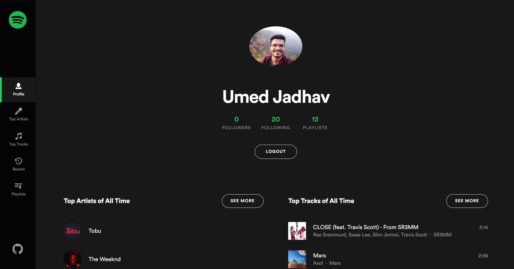
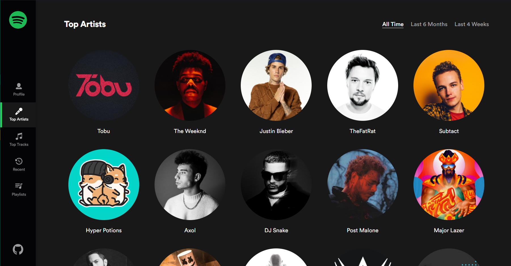
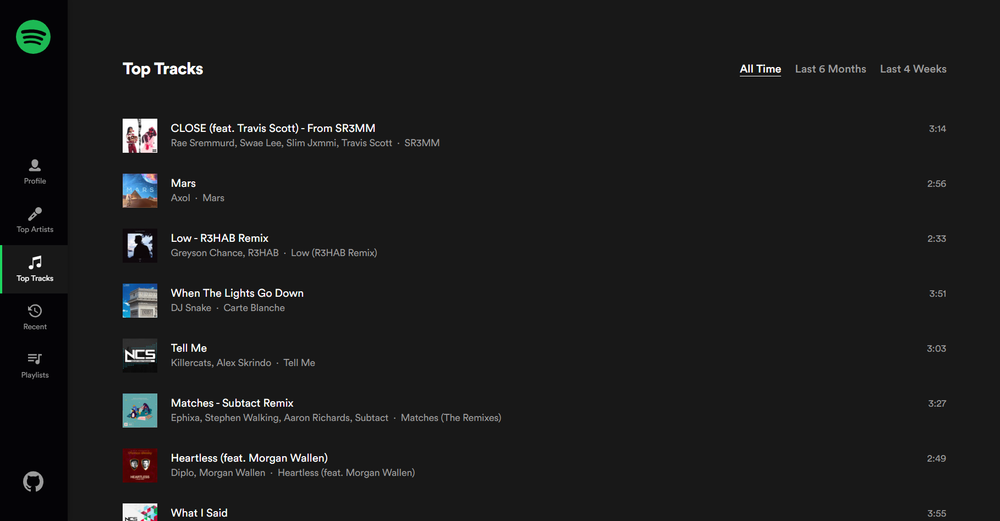
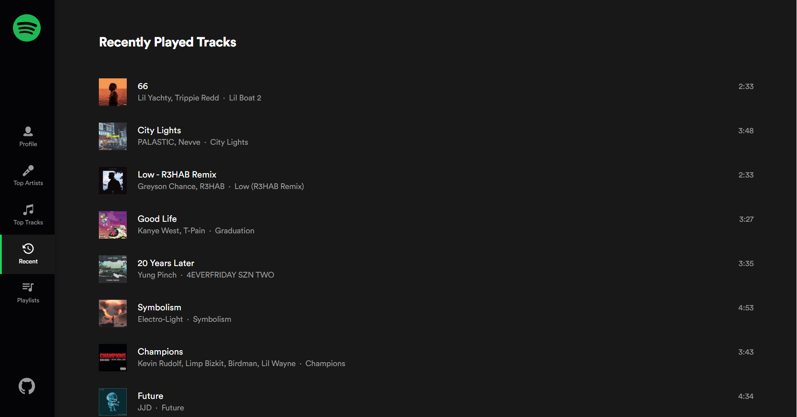
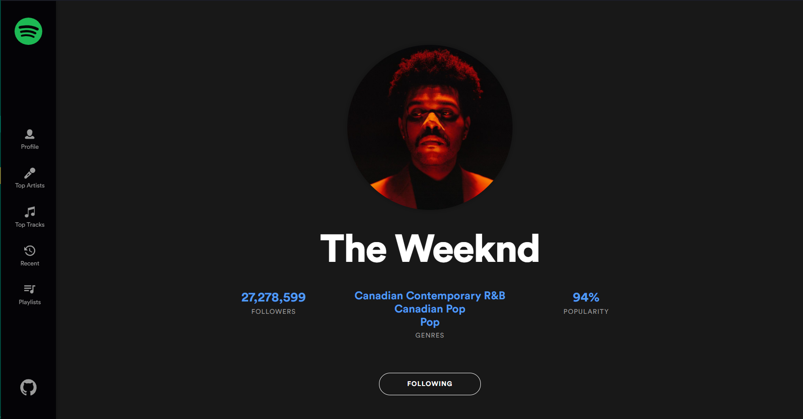
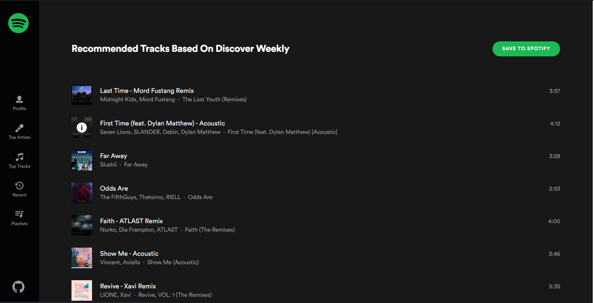
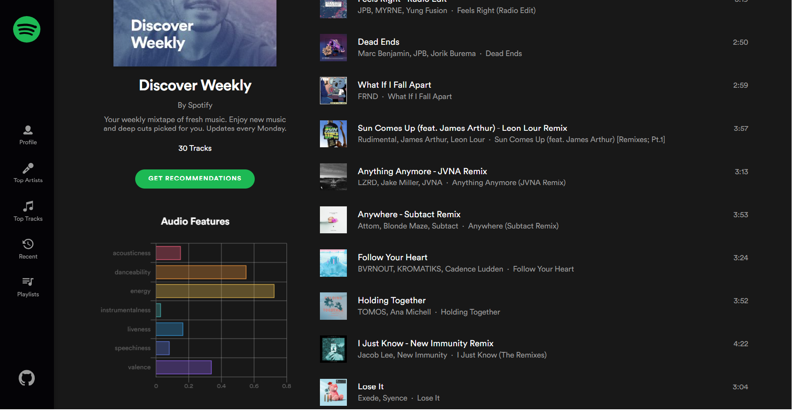
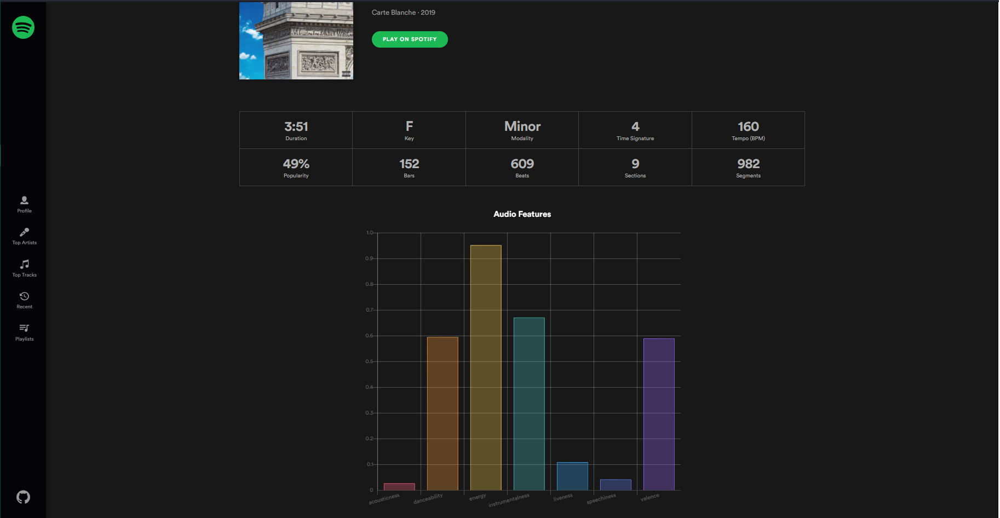

# Spotify Overview

### A web app for visualizing personalized Spotify data 

> built using Spotify Web API , Create React App , Express , React Router , Styled Components

Check the Live Demo [here](https://spotify-overview-app.herokuapp.com/)

---------------------------------

## Screenshots: 
-----------------------
### 1. Front Page 

### 2. Top Artists

### 3. Top Tracks

### 4. Recent Played

### 5. Artist Info

### 6. Playlists based Recommendation

### 7. Playlist Analysis

### 6. Song Analysis

